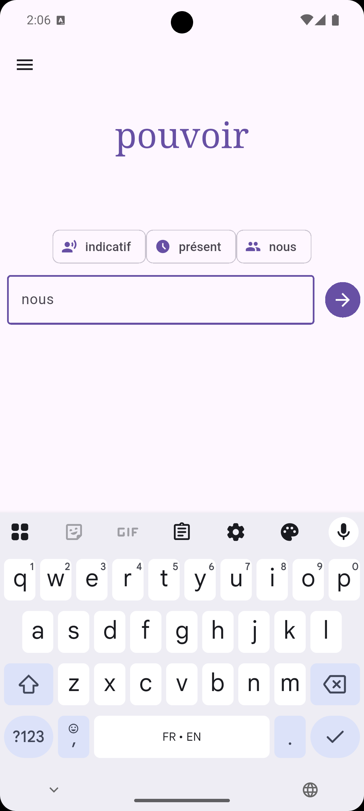
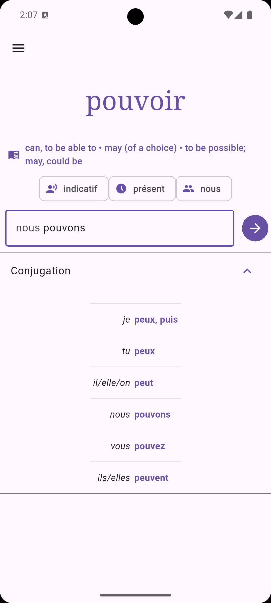
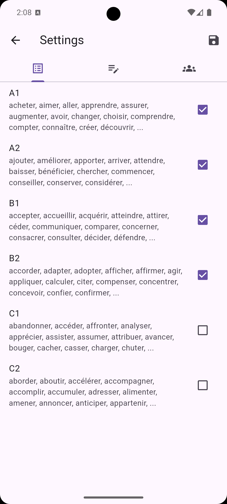
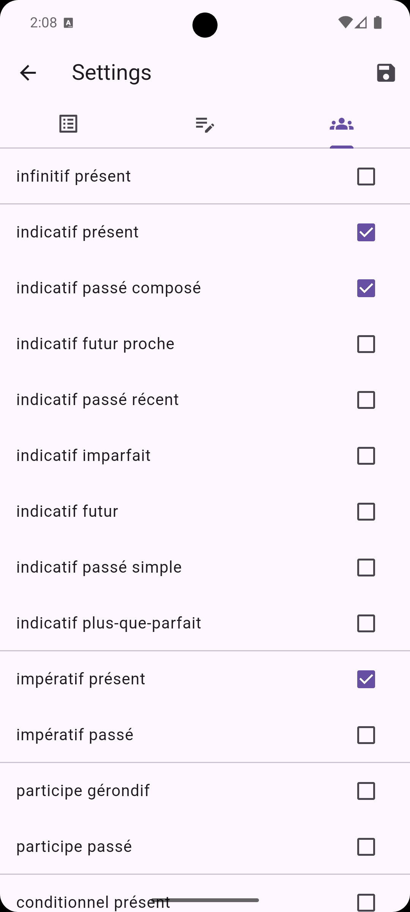
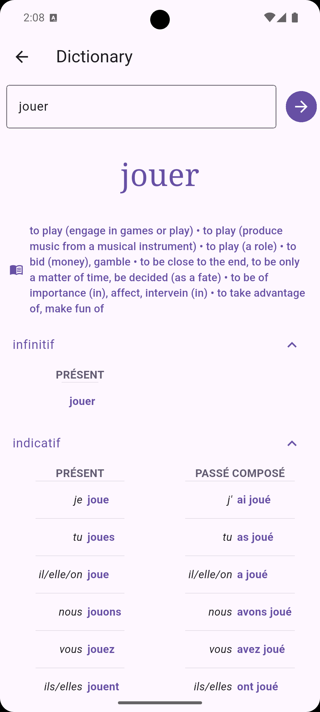

# Le Petit Conjugueur

An offline and open-source French verb conjugation practice app.

## Usage

Fire up the app to start the *Verb quiz* - conjugate the given verb to the tense specified! Within the options, you can select which tenses you want to be quizzed on, and disable the ones you haven't been taught yet.

The options also allow you to select from some pre-defined verb lists - A1, A2, B1, B2, C1, and C2, based on verbs you might find in typical DELF/DALF tests at those levels. 

In both the tenses and verb lists, if you don't select any options, the verb quiz can select from any tenses and verbs available in the app. 

Type in your answer in the *Verb quiz*, and the app will let you know if you are right or wrong - the accents must all be correct to get the answer right!

If you don't want to type, do the quiz in your head - the app will show you the answer if you leave the input box empty. Useful to quickly quiz yoursef on the Metro.

The *Dictionary* app lets you look up a specific verb to get all the conjugations. Look up the infinitive, or the conjugated form to find out what infinitive it comes from. There are over 6000 verbs built in to the app, most of which have definitions.

## Screenshots

## Motivation

I wanted a simple and offline app to help me learn French verb conjugations. I didn't want any gamification - there are no points or scores here, it's just about getting the practice embedded in my head. 

I also wanted something that would just throw random forms at me - its too easy for me to conjugate through all verb forms in order, I have always found it more difficult to get to the right form directly.

And I wanted something that I could both use to challenge me to get the word correct with all the accents in the right place, but also something that I could just quickly click through and do in my head. 

And finally, I wanted something for when I read an article, and just can't figure out what verb a word came from - and let me know the full conjugation of that verb.

Does it work? I don't know, I'm still learning!

## Verb sources

### Kaikki Wikitionary extract

* Source: [https://kaikki.org/dictionary/French/pos-verb/index.html](https://kaikki.org/dictionary/French/pos-verb/index.html)
* Tatu Ylonen: [Wiktextract: Wiktionary as Machine-Readable Structured Data](http://www.lrec-conf.org/proceedings/lrec2022/pdf/2022.lrec-1.140.pdf), Proceedings of the 13th Conference on Language Resources and Evaluation (LREC), pp. 1317-1325, Marseille, 20-25 June 2022

### Verbiste

* Source: [http://sarrazip.com/dev/verbiste.html](http://sarrazip.com/dev/verbiste.html)
* Copyright (C) 2003-2016 Pierre Sarrazin <http://sarrazip.com/>

The Verbiste source files are used under the terms of the Verbiste licence GPL v2 (`assets/dictionaries/gpl-2.0.txt`).